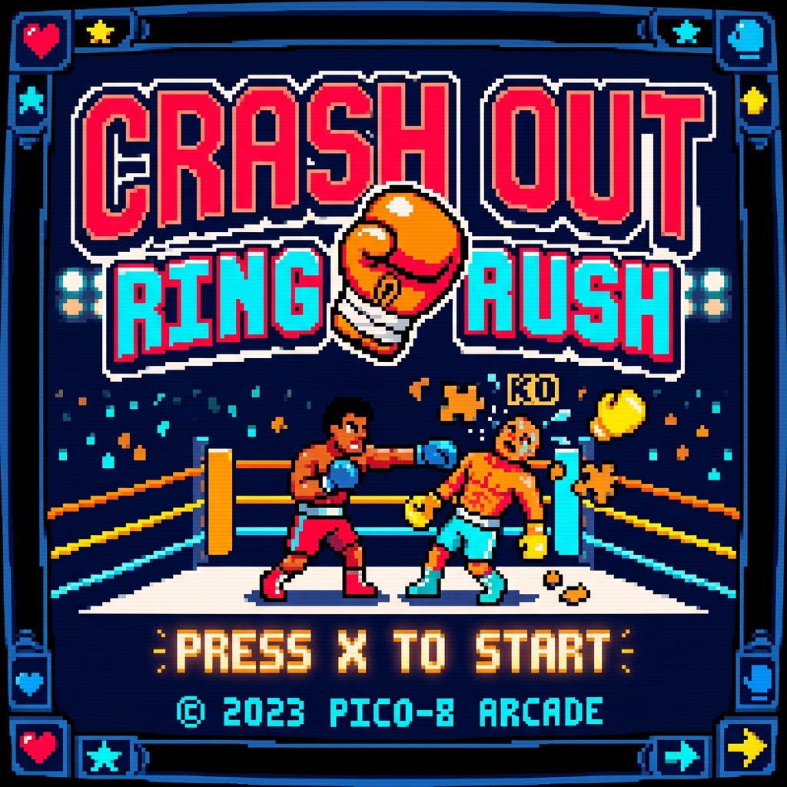
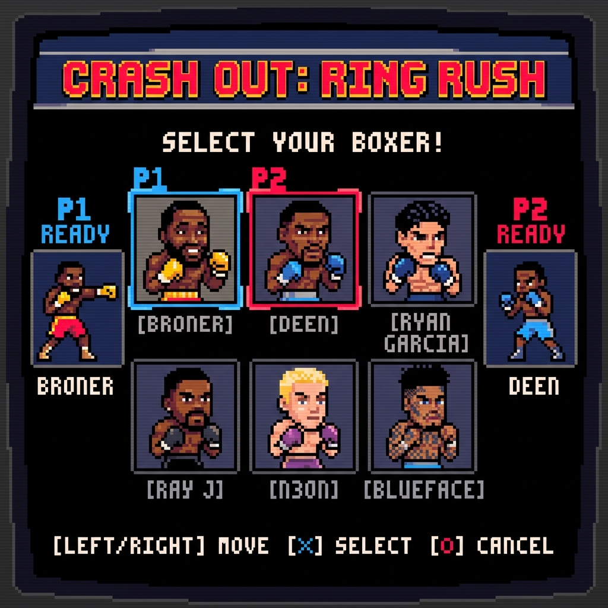
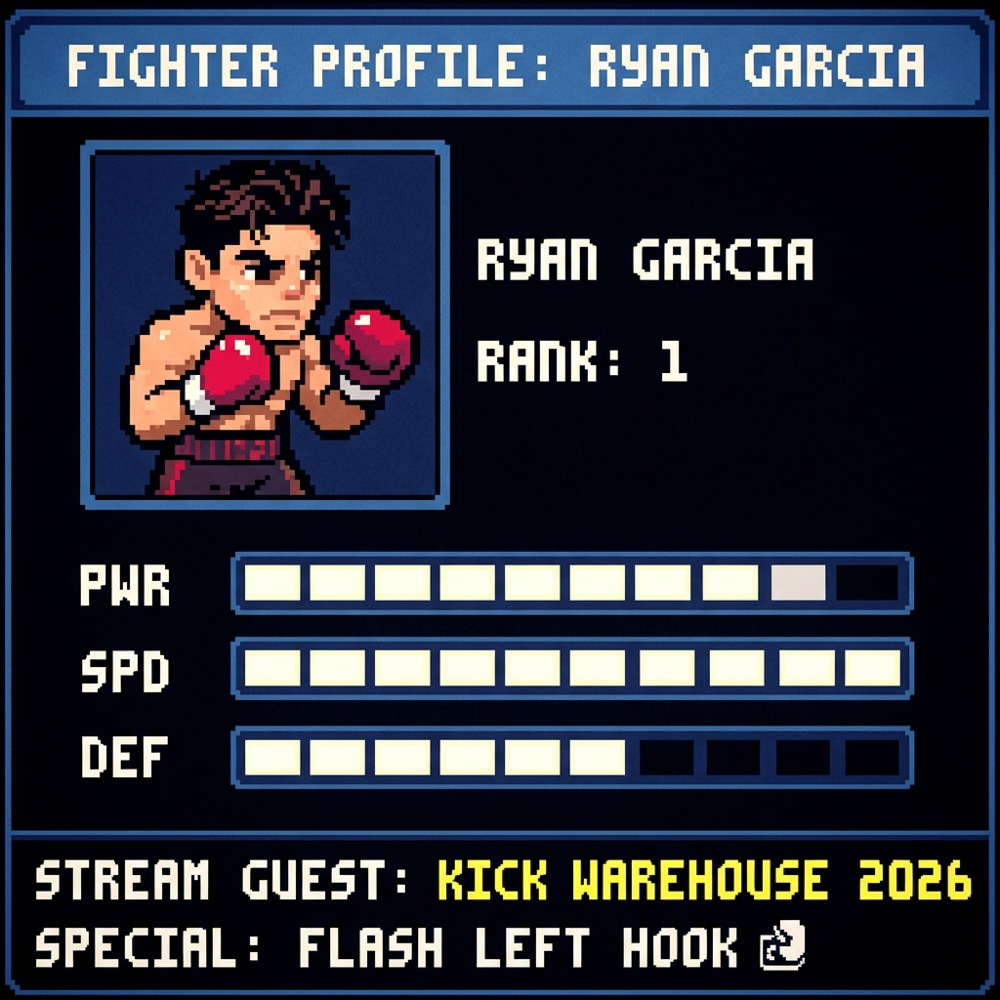
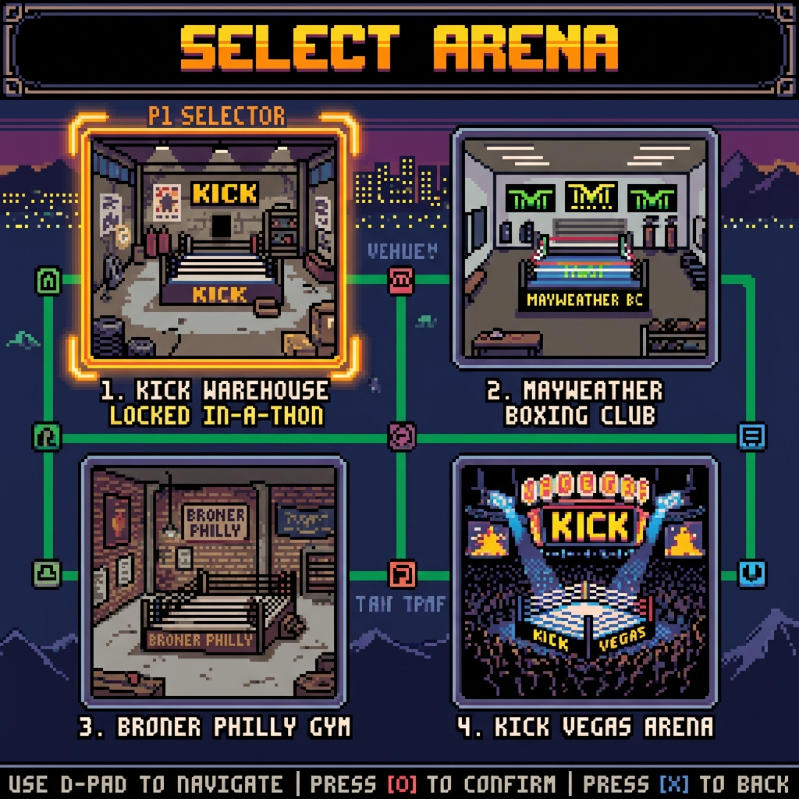
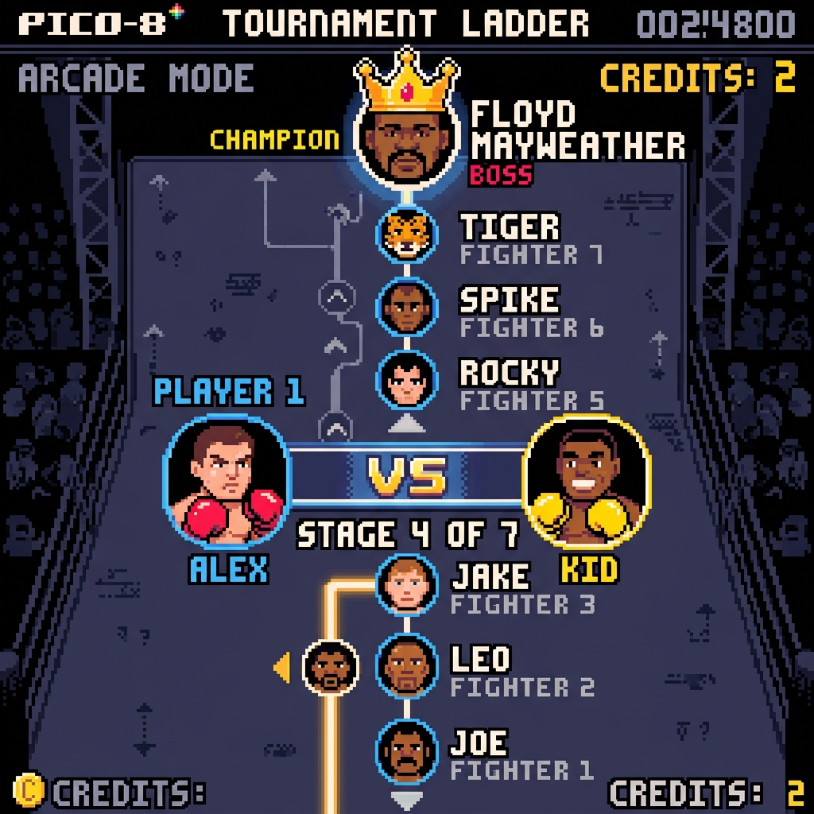
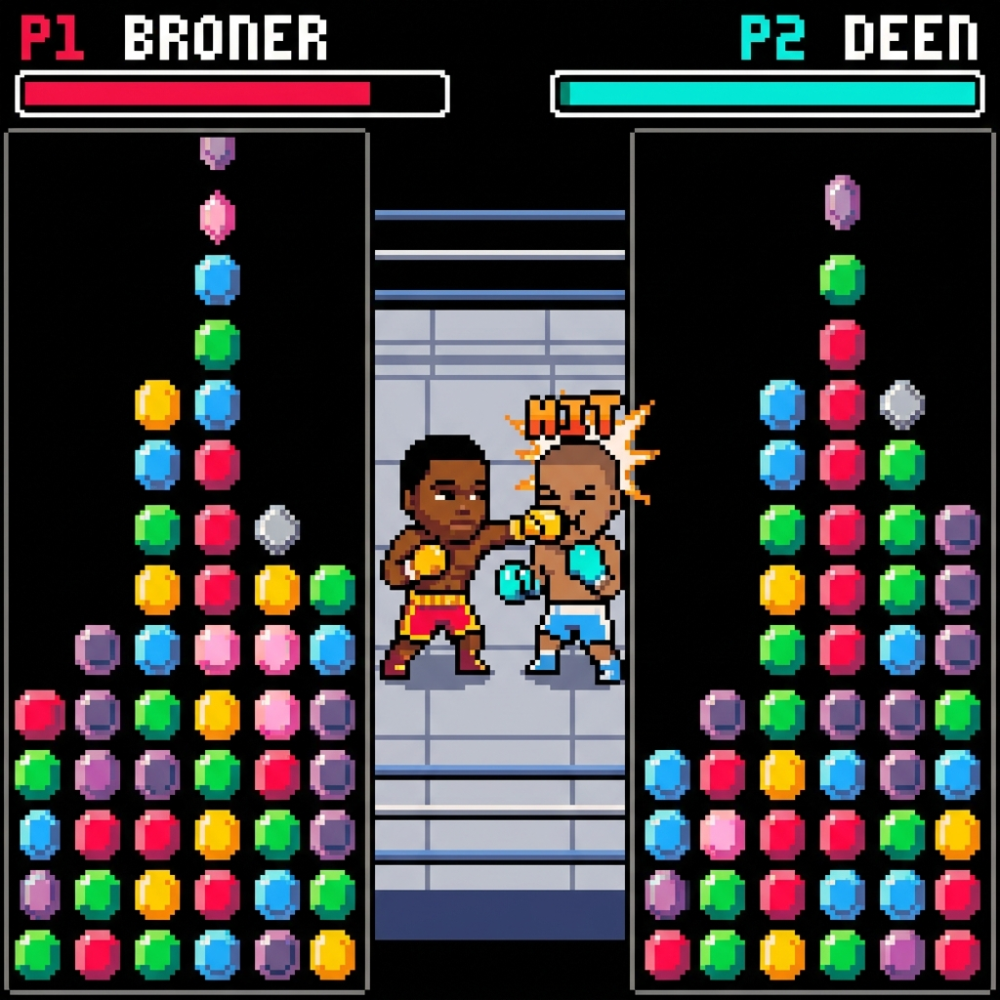
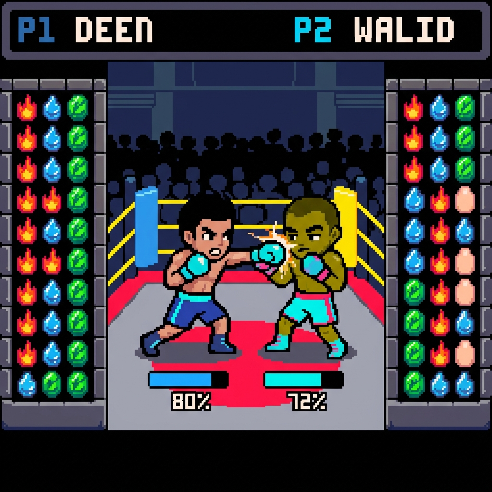
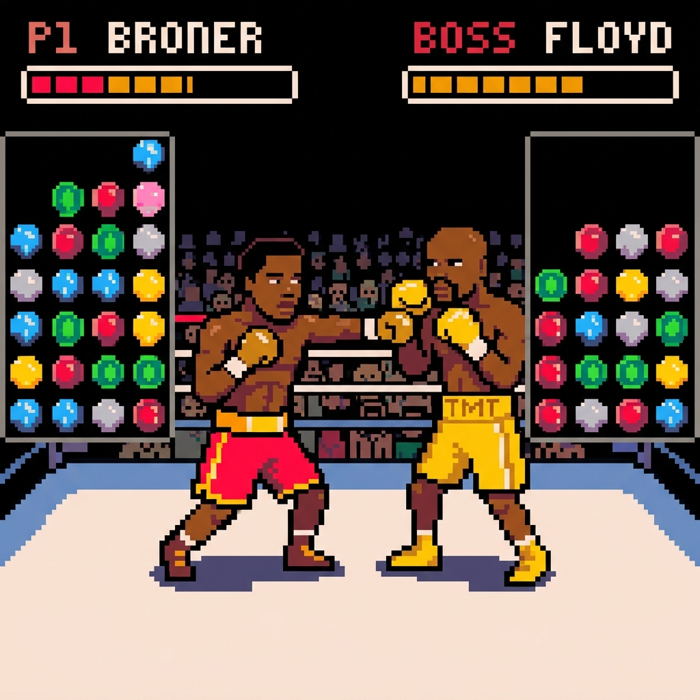
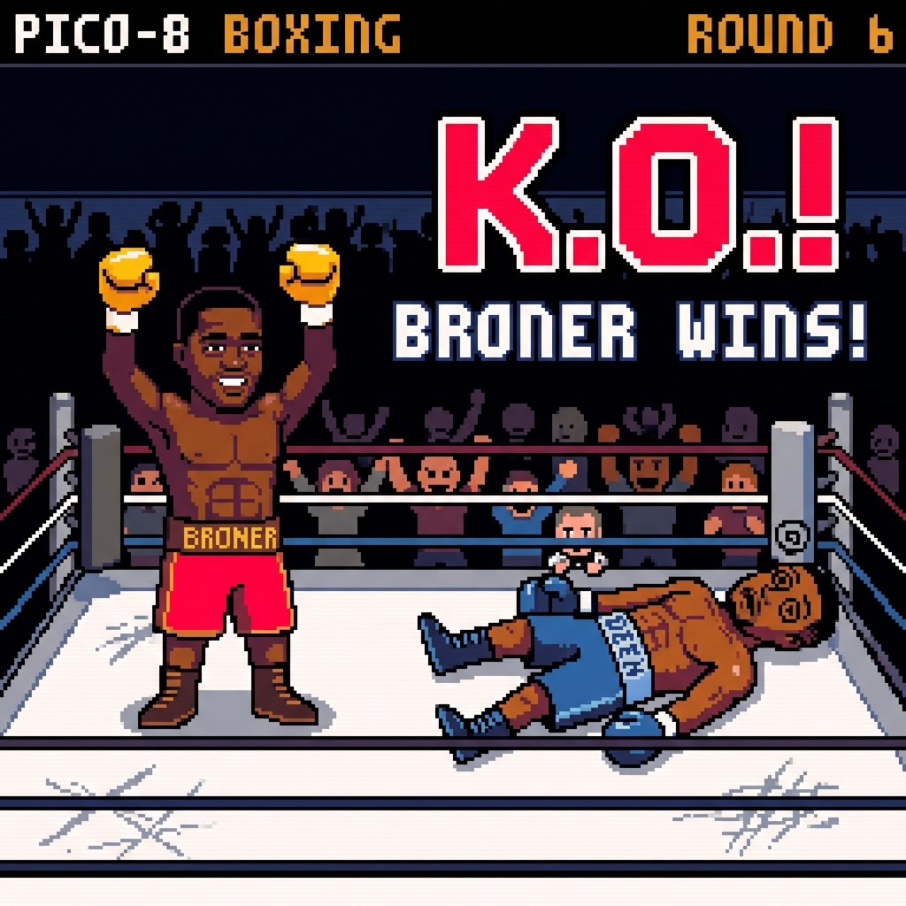

# CRASH OUT: RING RUSH — PICO-8 PUZZLE BOXING

**Version:** `v2.4.0` (Pocket Taco Controller & Landscape Viewport Support Release)

**Crash Out: Ring Rush** is an 8-bit arcade versus puzzle-fighter developed for the **PICO-8 Fantasy Console**. It fuses the competitive mechanics of Capcom's *Super Puzzle Fighter II Turbo* with the viral Kick warehouse boxing stream culture hosted by **Adrien "The Problem" Broner** and **Deen The Great**.

---

## 🎮 Play Live (v2.4.0)

- ⚡ **Play Live in Browser (GitHub Pages)**: **[officebeats.github.io/beats-social-media-boxer-game](https://officebeats.github.io/beats-social-media-boxer-game/)**
- 🕹️ **Native PICO-8 Cartridge**: Load [`crash_out.p8`](crash_out.p8) directly inside PICO-8 using `pico8 -run crash_out.p8`.

### Controls
- **Arrow Left / Right**: Move falling gem pair
- **Arrow Down**: Soft drop
- **Arrow Up**: Hard drop (Instant lock)
- **Z**: Rotate Counter-Clockwise
- **X**: Rotate Clockwise / Confirm / Trigger SUPER (when 100%)
- **B**: View Fighter Bio (Character Select)

---

## 🌟 New in v2.4.0
- 🌮 **Pocket Taco & Horizontal Clamp Controller Support**: Native HTML5 Gamepad API driver automatically detects and maps Pocket Taco, Backbone One, Razer Kishi, GameSir, and all standard Bluetooth/USB gamepads:
  - **D-Pad / Left Stick**: Move Left/Right, Soft Drop (Down), Hard Drop (Up / R).
  - **A / B / X / Y Buttons**: A (Drop/Super/Confirm), B (Rotate/Back), X (Rotate CCW), Y (Super Finisher).
  - **Shoulder Triggers & Center Pills**: L1/L2 (Back), R1/R2 (Super/Hard Drop), Select (Mode), Start (Confirm/Pause).
  - **Knockdown Mashing Support**: Mash any controller button to build stamina and beat the 10-count!
- 📱 **Landscape Handheld Viewport Resizing**: Mobile devices docked into horizontal controllers automatically expand to full width (`@media orientation: landscape`), centering the 1:1 PICO-8 screen at maximum vertical height flanked by ergonomic side controls.
- 🎮 **Game Boy Advance (GBA) Mobile Handheld Console Shell**: Mobile viewports transform into an authentic GBA handheld device with power LED and molded D-Pad.
- 🎨 **12 Dynamic GBA Handheld Console Skins**: Tap the top-bar **\`🎨 SKIN\`** button at any time to instantly cycle through 12 authentic hardware themes:
  1. **Classic Indigo** (2001 Original GBA Violet & Burgundy)
  2. **Championship Gold** (TMT / About Billions Luxury SP)
  3. **Atomic Purple** (Glacier Translucent Clear-Tech)
  4. **Kick Stealth** (Matte Black & Cyberpunk Green)
  5. **Arctic White** (Clean Snow White & Slate Blue)
  6. **Flame Red** (SP Classic Gloss Red & Gold)
  7. **Cobalt Blue** (Deep Metallic Blue & Yellow)
  8. **Platinum Silver** (Brushed Metal & Crimson)
  9. **Cyber Neon** (Miami 80s Synthwave Magenta & Cyan)
  10. **Retro DMG 1989** (Original Game Boy Gray & Maroon)
  11. **Tiger Orange** (Cincinnati Problem Edition)
  12. **Emerald Jade** (Pokemon Rayquaza Jade & Gold)
- 🎬 **Unified Authentic Capcom Boxer Sprites in All Cutscenes**: Replaced primitive block avatars with the exact 16-bit Capcom arcade fighter sprites used in combat across all cutscenes (`STAGE_INTRO`, `STAGE_VICTORY_CUTSCENE`, `LADDER_SHOP`, and `VICTORY_END`).
- 🏆 **Post-Fight Press Conference Cutscenes (`STAGE_VICTORY_CUTSCENE`)**: Upon winning each Road to Gold bout, view the post-fight press conference cutscene with the standing winner flexing, defeated opponent down on canvas, viral stream quotes, and stage purse breakdown before entering the Trainer Gym Shop.
- 🥊 **7-Stage 'Road to Gold' Tournament Campaign (28–35 Min)**: Full tournament ladder progressing through N3ON, Adin Ross, Blueface, Walid Sharks, Ryan Garcia, Semi-Final Boss **Gervonta 'Tank' Davis**, and Final Boss **Floyd 'Money' Mayweather**.
- 🥊 **Knockdown 10-Count Puzzle Survival**: Dropping to 0 HP triggers an authentic referee 10-count. Mash **\`Z\` / \`X\` / \`Space\` / \`Enter\` or tap screen** to fill the **Get-Up Stamina Meter** and score a second-wind recovery (+28 HP) before count 10!
- 🥊 **Three-Knockdown TKO Rule**: Authentic boxing rules where a 3rd knockdown in the same round triggers an immediate technical knockout.
- 🏅 **Multi-Round Best 2-of-3 Engine**: Matches require 2 round victories, tracked via golden glove win indicators (⭐ ⭐) on the HUD.
- 🏪 **Trainer Gym Upgrade Shop (`LADDER_SHOP`)**: Spend stage fight purses on persistent upgrades: **Heavy Hands (PWR Lv 1-3)**, **Iron Chin (DEF Lv 1-3)**, **Fast Hands (SPD Lv 1-3)**, **Diamond Seed Perk**, and **Super Rush Perk**.
- 💾 **Persistent Save & Resume System**: Auto-saves campaign state, purse, and purchased upgrades to `localStorage` so 30-minute runs can be resumed anytime from Mode Select.
- 🔄 **Universal Back & Home Navigation**: Pressing `Escape` or clicking top-left `<` returns smoothly all the way back to the Title/Home screen from any menu.

### Character Select (14 Verified Stream Guests)

### Fighter Profile & Bio (Ryan Garcia)

### Stream Arena Selection

### Arcade Tournament Ladder

### Active Battle View (P1 BRONER vs P2 DEEN)

### Stream Rivalry Matchup (DEEN vs WALID SHARKS)

### Boss Fight (BRONER vs FLOYD MAYWEATHER)

### K.O. & SUPER Finisher Screen

---

## 🌟 Verified Real-Life Stream Guest Roster

Every character on the 14-fighter roster represents a verified host or guest from the 2026 Kick warehouse boxing streams:

1. **Adrien "The Problem" Broner** (Co-Host, Philly Shell Defense)
2. **Deen The Great** (Co-Host, Lightning Southpaw Straight)
3. **Ryan Garcia** (Warehouse Stream Guest, Flash Left Hook)
4. **N3ON** (Streamer Guest, Crash Out Spam)
5. **Ray J** (Celebrity Stream Guest, Glasses Flash Counter)
6. **Blueface** (Rapper/Boxer Stream Guest, Famous Hook)
7. **Chrisean Rock** (Stream Guest, Baddie Overhand)
8. **Rampage Jackson** (MMA Legend Stream Guest, Rampage Slam)
9. **Adin Ross** (Kick Collaborator, Stream Raid Bomb)
10. **Charleston White** (Iconic Stream Guest, Microphone Rant)
11. **Walid Sharks** (Stream Guest & Deen Rival, Shark Attack Combo)
12. **Antonio Brown** (NFL Star Stream Guest, CT KO Dance)
13. **Gervonta "Tank" Davis** (Boss, Tank Uppercut KO)
14. **Floyd "Money" Mayweather** (Final Boss, 50-0 Shoulder Roll)

---

## 🛠️ PICO-8 Technical Specifications

- **Native Resolution**: 128 × 128 Pixels (1:1 Aspect Ratio)
- **Palette**: PICO-8 Fixed 16-Color Palette
- **Frame Rate**: 30 FPS (`_update()`) / 60 FPS (`_update60()`)
- **Controls**: D-Pad + 🅾️ (Rotate CCW / Select) + ❎ (Rotate CW / SUPER)
- **Audio**: 4-channel native PICO-8 chiptune synthesizer
- **Target Budget**: ≤ 8,192 Lua Tokens, 32 KB compressed cart size

---

## 📄 Documentation

- **Game Design Document**: [`GDD.md`](GDD.md)
