# 🥊 CRASH OUT: RING RUSH — The Ultimate Adrien Broner, Deen The Great & COB (Crash Out Boys) Retro Puzzle Boxing Game

[](https://officebeats.github.io/beats-social-media-boxer-game/)
[](https://officebeats.github.io/beats-social-media-boxer-game/)
[](https://officebeats.github.io/beats-social-media-boxer-game/)
[](https://officebeats.github.io/beats-social-media-boxer-game/)
[](https://officebeats.github.io/beats-social-media-boxer-game/)
[](https://officebeats.github.io/beats-social-media-boxer-game/)

---

## ⚡ Play Instantly in Your Browser

🎮 **[Click Here to Play CRASH OUT: RING RUSH Live on GitHub Pages](https://officebeats.github.io/beats-social-media-boxer-game/)**  
*(Optimized for Mobile, Desktop, Touchscreens, Keyboard & Bluetooth Gamepads)*

---

## 📖 Overview & Concept

**Crash Out: Ring Rush** is an adrenaline-fueled 8-bit arcade puzzle-fighter built for the **PICO-8 Fantasy Console** and modernized with a high-performance **HTML5 Canvas 60 FPS engine**. 

The game combines the legendary competitive match-and-crush mechanics of Capcom's *Super Puzzle Fighter II Turbo* with the viral high-stakes culture of the **Kick warehouse boxing streams**, hosted by 4-division World Champion **Adrien "The Problem" Broner** and influencer boxing world champion **Deen The Great**, alongside the broader **Crash Out Boys (COB)** universe.

Step into the squared circle as your favorite social media boxers, YouTube & Kick streamers, and world-class champions. Clear colored gems, trigger massive combo cascades, execute signature special punches, survive dramatic 10-count knockdowns, and climb the 7-Stage **Road to Gold** tournament ladder to claim the 50-0 Championship Belt!

---

## 📸 Screenshots Showcase

Experience the retro arcade presentation with authentic 16-bit boxer sprites, animated arenas, and responsive GBA handheld aesthetics:

### 1. 🏠 Home Screen (Title & Exhibition)
*Live Kick broadcast ticker (`LIVE 148K KICK.COM/BRONER`), title logo, and dynamic center-ring exhibition featuring animated 4-frame idle bouncing Adrien Broner and Deen The Great.*

| Crisp PICO-8 Direct View | Full GBA Handheld Console Experience |
| :---: | :---: |
| 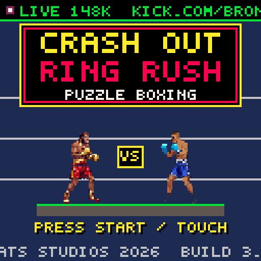 | 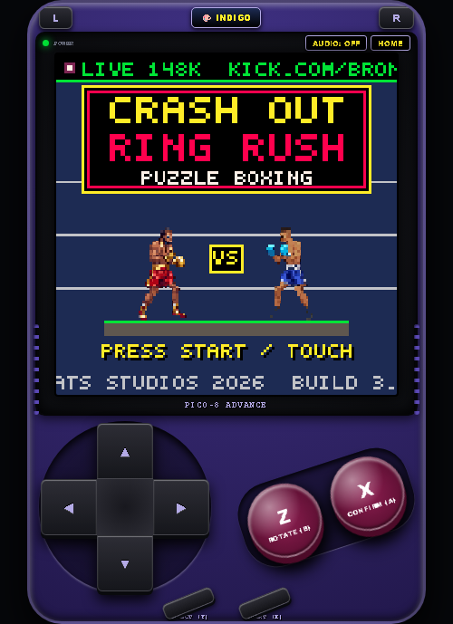 |

---

### 2. 🕹️ Game Mode Selection
*Choose between the deep 30-minute 7-Stage Road to Gold Tournament Campaign, single Quick Exhibition, 2P Local Head-to-Head, or CPU Watch Demo mode.*

| Mode Selection Screen | GBA Mode Navigation |
| :---: | :---: |
| 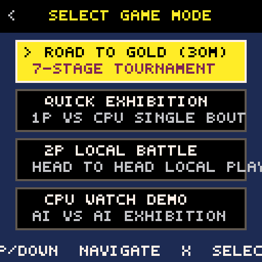 | 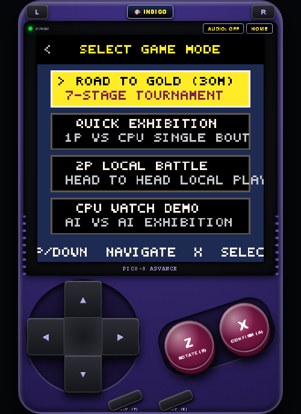 |

---

### 3. 🥊 Boxer Selection (14-Fighter COB Roster)
*2x7 character grid showcasing 14 viral stream stars with animated idle portraits, Power/Speed/Defense stat bars, special moves, unlock status, and Drip/Alt Outfit toggle.*

| Fighter Select (Adrien Broner & Deen The Great) | Fighter Select (Alt Viral Stream Outfit) |
| :---: | :---: |
| 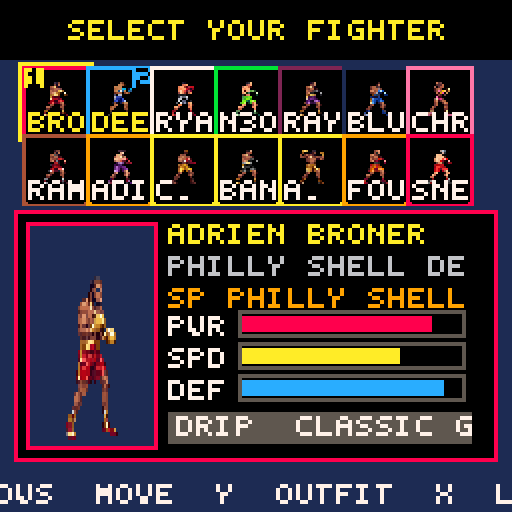 | 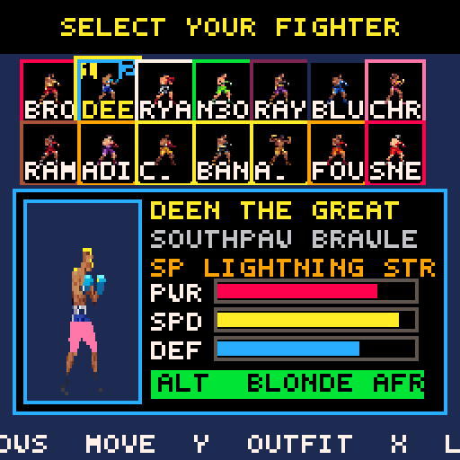 |

---

### 4. 🏟️ Stage Selection (9 Dynamic Venues & Tournament Bracket)
*Fight across 9 global stream locations ranging from the Austin Kick Warehouse to the Tokyo Cyber Dome, or navigate the 7-Stage Tournament Ladder.*

| 9 Dynamic Stream Arenas | 7-Stage Tournament Bracket |
| :---: | :---: |
| 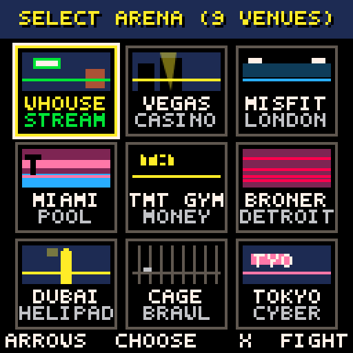 | 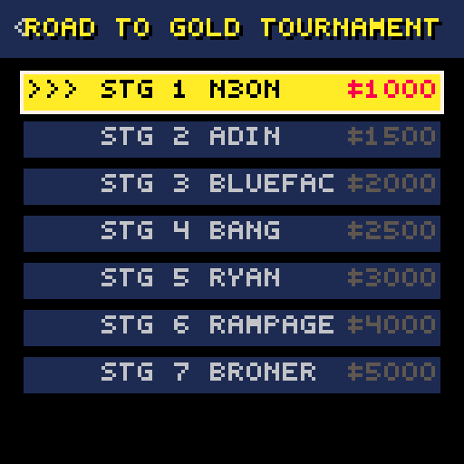 |

---

### 5. 💥 Live Boxing Match Gameplay in Action
*Fast-paced dual-board puzzle combat with falling gem pairs, power gem fusions, floating combo banners (`COMBO X3!`), super meter bursts, grounded in-ring boxers, live chat ticker, and animated crowd.*

| In-Ring Combat & Puzzle Playfields | GBA Battle View |
| :---: | :---: |
| 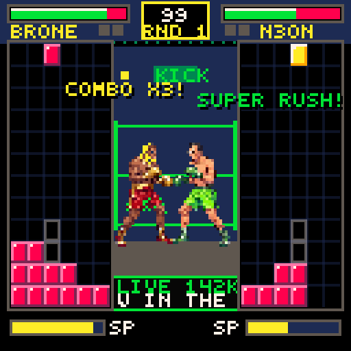 | 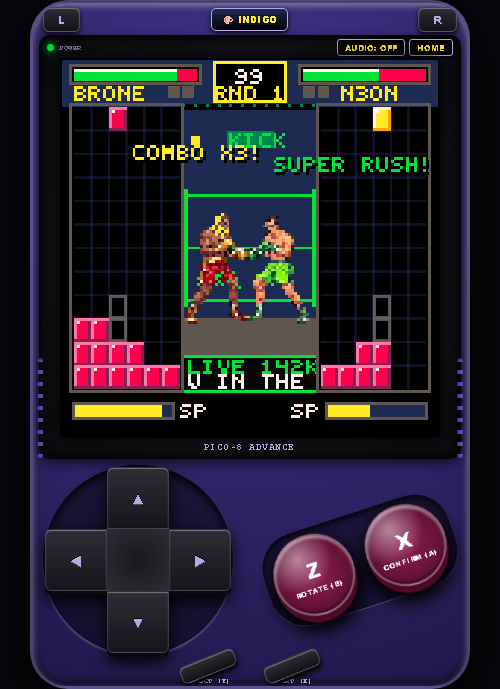 |

---

### 6. ⏱️ Knockdown 10-Count Puzzle Survival
*Authentic boxing knockdown system: Dropping to 0 HP triggers the referee 10-count overlay with pulsing red vignette, fallen boxer on canvas, and rapid button mashing / gem clearing for a +28 HP second-wind recovery.*

| Referee 10-Count Survival Overlay | Knockdown Scene in GBA View |
| :---: | :---: |
| 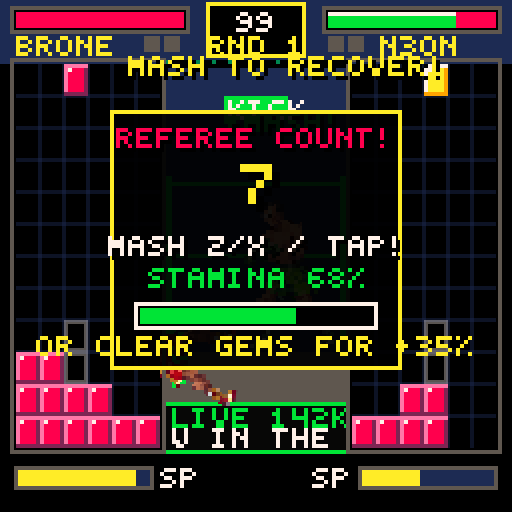 | 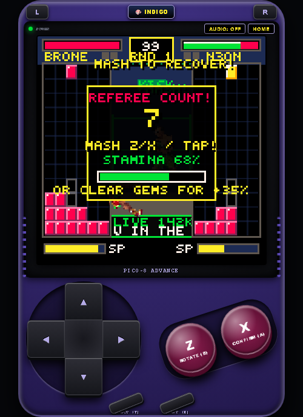 |

---

### 7. 🏪 Trainer Gym Upgrade Shop & Press Conference Cutscenes
*Earn purse money from each bout, attend post-fight press conferences, and upgrade Power, Defense, Speed, and Perks at the Gym Shop.*

| Trainer Gym Upgrade Shop | Post-Fight Press Conference Cutscene |
| :---: | :---: |
| 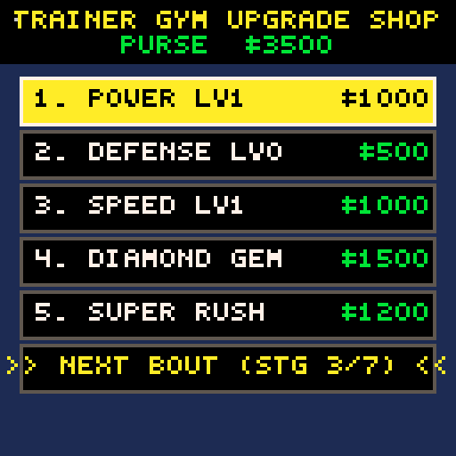 | 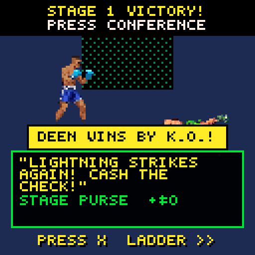 |

---

## 🌟 The Complete 14-Fighter COB & Boxing Roster

Every character in **Crash Out: Ring Rush** represents a real-life host, streamer, or guest from the **2026 Kick warehouse boxing streams** and **Crash Out Boys (COB)** events, each featuring custom stats, signature special moves, 4-frame athletic boxing idle animations, and unlockable alternate viral outfits:

| Fighter Name | Boxing Alias / Persona | Signature Move | PWR | SPD | DEF | Classic Outfit | Alt Viral Drip Skin |
| :--- | :--- | :--- | :---: | :---: | :---: | :--- | :--- |
| **Adrien Broner** | *"The Problem"* (4-Div Champ) | Philly Shell Counter | 90 | 85 | 95 | Gold Trunks & Headband | Bleached Blonde Wave & Neon Trunks |
| **Deen The Great** | *"Misfits Champ"* (Starter) | Southpaw Lightning Straight | 85 | 95 | 80 | Black Afro & Gold Trunks | Bleached Afro & Hot Pink Drip |
| **Ryan Garcia** | *"King Ry"* (WBC Star) | Flash Left Hook | 95 | 95 | 75 | Black Quiff & Red Trunks | Golden Crown & Silk Stream Robe |
| **N3ON** | *"Warehouse Streamer"* | Crashout Spam | 60 | 90 | 65 | Crashout Blue Hoodie | Padded Headgear & Neon Gym Gear |
| **Ray J** | *"Tech Mogul / Host"* | Glasses Flash Counter | 75 | 80 | 85 | Emerald Silk Trunks | Gold Aviators & Platinum Silk Robe |
| **Blueface** | *"Famous Cryp"* | Famous Overhand Hook | 85 | 80 | 75 | Famous Blue Bandana | Street Brawl Cash Bandana & Chinos |
| **Chrisean Rock** | *"Baddie Brawler"* | Baddie Power Overhand | 90 | 80 | 80 | Baddie Pink Top & Trunks | Braided Crown & Camo Combat Trunks |
| **Rampage Jackson** | *"MMA Heavyweight Icon"* | Rampage Monster Slam | 100 | 65 | 95 | Heavyweight Tank Black | Pride FC Camo & Monster Chain |
| **Adin Ross** | *"Kick Stream Kingpin"* | Stream Raid Bomb | 70 | 85 | 75 | 777 Black Hoodie | Designer White Tee & Vegas Gold |
| **Charleston White** | *"Viral Commentator"* | Microphone Pepper Rant | 75 | 85 | 80 | Iconic Brown Fedora | Cowboy Hat & Southern Leather Vest |
| **Coach Bang** | *"Warehouse Head Trainer"* | Bang Body Hook Combo | 85 | 85 | 90 | Coach Grey Tracksuit | Corner Tracksuit & Digital Stopwatch |
| **Antonio Brown (AB)** | *"CT Football Star"* | CT KO Showboat Dance | 90 | 90 | 70 | CT Gold Showboat Gear | Retro Jersey & Platinum Helmet Cap |
| **Fousey** | *"G7 Commander"* | G7 Spiritual Crash Out | 80 | 85 | 80 | G7 Red Headband | Mala Meditation Beads & Black Tank |
| **Sneako** | *"Matrix Sparrer"* | Red Pill Weave Counter | 80 | 90 | 75 | Matrix Black Sparring Gear | Red Pill Crimson Hoodie & Stealth Gear |

---

## 🏟️ 9 Dynamic Animated Arenas

Battle across 9 unique venues featuring custom animated backgrounds, dynamic crowd dithering, flashing camera effects, and live stream chat tickers:

1. 🏭 **Kick Warehouse (Austin, TX)**: The home of the Crash Out Boys with pulsing green Kick neon signs, forklift strobe lights, and active stream chat.
2. 🎰 **Vegas Casino Arena (Las Vegas, NV)**: Dual sweeping golden searchlights cutting through the skyline with shimmering coin effects on knockdowns.
3. 🇬🇧 **Misfits London Arena (London, UK)**: Intense cyan floodlight laser beams and flashing ringside paparazzi bulbs.
4. 🌴 **Miami Stream Mansion (Miami, FL)**: Tropical sunset gradient sky, swaying neon palm trees, and pool water ripple reflections.
5. 💰 **TMT Vegas Gym (Las Vegas, NV)**: Floyd Mayweather's personal gym featuring a solid gold heavy bag, cash stack accents, and overhead spotlights.
6. 🚨 **Cincinnati Problem Gym (Cincinnati, OH)**: Adrien Broner's home gym with exposed red brick walls, flashing red warning sirens, and swinging heavy chains.
7. 🏙️ **Dubai Penthouse Helipad (Dubai, UAE)**: Rotating Burj Khalifa aerial beacon, gold rope tassels, and sunset skyline.
8. ⛓️ **Underground Fight Cage (Atlanta, GA)**: Steel chainlink cage lattice, dark alley atmosphere, and rising floor steam vents.
9. 🗼 **Tokyo Neon Dome (Tokyo, JP)**: High-speed scrolling Japanese kanji LED ticker (`TOKYO RUSH`) and cyber magenta laser grids.

---

## 🎮 Game Modes

### 1. 🏆 Road to Gold Campaign (30-Minute 7-Stage Tournament)
Start with **Deen The Great** as your default contender and embark on a 7-stage gauntlet against increasingly dangerous rivals:
- **Stage 1**: N3ON *(The Warmup Brawl)*
- **Stage 2**: Adin Ross *(Miami Stream Raid)*
- **Stage 3**: Blueface *(Street Brawl Grudge)*
- **Stage 4**: Coach Bang *(Problem Gym Brawl)*
- **Stage 5**: Ryan Garcia *(London Contender Bout)*
- **Stage 6**: Rampage Jackson *(Semi-Final Boss: Heavyweight Tank)*
- **Stage 7**: Floyd Mayweather *(World Championship Boss: 50-0 Legend)*

*Features strict anti-skip progression, post-fight press conference cutscenes with fighter dialogue, and the Trainer Gym Upgrade Shop to buy Power, Defense, Speed, and Special Perks with your fight purse!*

### 2. 🥊 Quick Exhibition (1P vs CPU)
Jump straight into a single bout against any unlocked fighter in any of the 9 venues with custom AI difficulty.

### 3. 👥 2P Local Battle (Head-to-Head)
Play against a friend on the same device using shared keyboard controls or two connected Bluetooth gamepads.

### 4. 📺 CPU Watch Demo (AI vs AI)
Sit back and watch high-level CPU AI bots battle it out in real-time with full gem matching and super meter execution.

---

## 🕹️ Controls & Navigation

### Desktop Keyboard Controls
| Action | Key 1 | Key 2 | Alternative / Numpad |
| :--- | :---: | :---: | :---: |
| **Move Gem Left / Right** | `Arrow Left` / `Arrow Right` | `A` / `D` | `Numpad 4` / `Numpad 6` |
| **Soft Drop** | `Arrow Down` | `S` | `Numpad 2` |
| **Hard Drop (Instant Lock)** | `Arrow Up` | `W` | `Numpad 8` |
| **Rotate Counter-Clockwise (CCW)** | `Z` | `K` | `Numpad 1` |
| **Rotate Clockwise (CW) / Confirm** | `X` | `J` | `Numpad 3` / `Enter` |
| **Trigger 100% SUPER Finisher** | `X` | `J` | `Space` |
| **Mash Recovery (Knockdown 10-Count)** | `Z` / `X` (Mash) | `Space` / `Enter` | Any Action Key |
| **Switch Fighter Outfit (Drip/Alt Skin)** | `Y` | `C` | Touch Outfit Badge |
| **View Fighter Bio** | `B` | `V` | — |
| **Pause / Back / Main Menu** | `Escape` | `Backspace` | `<` Icon |

### Mobile Touch & Gamepad Controls
- **Virtual 3D Cross D-Pad**: Smooth thumb touch navigation for moving and dropping gems.
- **Action Buttons (A & B / X & O)**: Tactile rubber buttons for rotating and triggering super moves.
- **On-Screen Mash Area**: Tap anywhere on the game screen during a knockdown to pump the Get-Up Stamina meter.
- **Bluetooth Controller Support**: Fully compatible with standard Bluetooth Gamepads, Xbox / PlayStation controllers, and Pocket Taco micro-gamepads via the Gamepad API.

---

## 🎨 12 Retro GBA Handheld Console Skins

Personalize your retro gaming experience by cycling through 12 collectible GBA chassis skins (click the top-right **SKIN** pill on the console):

1. 🟣 **Classic Indigo**: Original 2001 GBA Indigo with maroon buttons.
2. 🟡 **Gold SP**: Special Edition metallic gold with crimson buttons.
3. 🍇 **Atomic Purple**: Translucent 90s retro purple chassis.
4. 🟢 **Kick Stealth**: Matte black casing with fluorescent Kick neon green buttons.
5. ⚪ **Arctic White**: Clean snow white body with slate blue accents.
6. 🔴 **Flame Red**: Gloss cherry red with metallic gold D-Pad.
7. 🔵 **Cobalt Blue**: Deep metallic royal blue with yellow action buttons.
8. 🪙 **Platinum Silver**: Brushed aluminium metal with crimson accents.
9. 🌆 **Cyber Neon**: Miami synthwave magenta with electric cyan trim.
10. 🕹️ **Retro DMG 1989**: Classic Game Boy pebble-gray with burgundy buttons.
11. 🐯 **Tiger Orange**: Cincinnati Problem edition vibrant amber and gold.
12. 🐲 **Emerald Jade**: Rayquaza-inspired forest green with gold trim.

---

## 🥊 Advanced Puzzle Combat Mechanics

- **Gem Pairs & Colors**: 4 vibrant gem colors (Red, Green, Blue, Yellow) drop in dual pairs.
- **Power Gem Fusion**: Adjacent matching gems automatically fuse into large rectangular **Power Gems** ($2\times 2$, $2\times 3$, $3\times 3$), multiplying damage output exponentially when crushed.
- **Trigger Crash Gems**: Glowing circular crash gems detonate all connected gems of the same color, triggering massive chain-reaction explosions.
- **Counter Countdown Blocks**: Damaging your opponent drops heavy stone timer blocks on their playfield (counting down $3 \rightarrow 2 \rightarrow 1$ with each gem clear).
- **100% Super Move Bar**: Landing combos fills the bottom Super Meter. At 100%, pressing `X` releases a devastating screen-shaking 360° radial particle blast that drops massive counter blocks on your opponent!
- **Knockdown 10-Count Survival**: Dropping to 0 HP initiates the referee count. Rapidly mash action keys or clear gems to boost your stamina bar to 100% and rise with a **+28 HP Second Wind**!
- **Three-Knockdown Rule**: Landing 3 knockdowns on an opponent within the same round results in an instant Technical Knockout (**T.K.O.**)!

---

## 💻 Tech Stack & Architecture

- **Engine**: PICO-8 Fantasy Console Lua / Standalone HTML5 Canvas ES6 Engine.
- **Resolution**: 128 × 128 Pixels native virtual resolution scaled dynamically with crisp integer nearest-neighbor sampling.
- **Graphics**: Custom $192\times 48\text{px}$ linear 4-frame athletic boxing idle animation strips playing at 7.5 FPS, grounded at mat line $Y=90$.
- **Performance**: Fixed 60 FPS timestep accumulator with sub-millisecond draw cycle and pre-rendered 48px sprite canvases (99.8% texture bandwidth reduction).
- **Sound**: Procedural chiptune 808 synthesizer with retro punch impacts, bell chimes, countdown ticks, and referee whistles.
- **State Storage**: Automatic `localStorage` campaign saving, tracking purse earnings, stage progression, and RPG gym upgrades.

---

## 🚀 How to Run Locally

### Option 1: Run with Python Web Server
```bash
# Clone the repository
git clone https://github.com/officebeats/beats-social-media-boxer-game.git
cd beats-social-media-boxer-game

# Start a local web server
python -m http.server 8000

# Open in your web browser
# Navigate to: http://localhost:8000
```

### Option 2: Run with Node.js
```bash
# Using npx serve
npx serve .
```

### Option 3: Run Native PICO-8 Cartridge
```bash
# If you have PICO-8 installed:
pico8 -run crash_out.p8
```

---

## 🔍 Search & SEO Keywords

*Adrien Broner Game, Adrien Broner Boxing Game, Deen The Great Game, Deen The Great Boxing Game, COB Game, Crash Out Boys Game, Crash Out Ring Rush, Kick Boxing Stream Game, Influencer Boxing Game, Super Puzzle Fighter Boxing, PICO-8 Boxing Game, Retro Arcade Boxing Puzzle, Adrien Broner vs Deen The Great, Ryan Garcia Boxing Game, N3ON Boxing Game, Adin Ross Boxing Game, Blueface Boxing Game, Chrisean Rock Boxing Game, Rampage Jackson Game, Floyd Mayweather 50-0 Boss Fight, 8-bit Handheld Boxing Game.*

---

## 📜 License & Credits

- **Game Design & Development**: © 2026 **Office Beats Studios**
- **Inspiration**: Capcom's *Super Puzzle Fighter II Turbo*, Nintendo's *Punch-Out!!*, and the Kick stream boxing culture.
- **Distribution**: Open-source web edition hosted on GitHub Pages.
