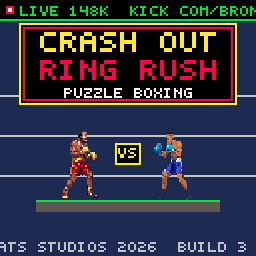
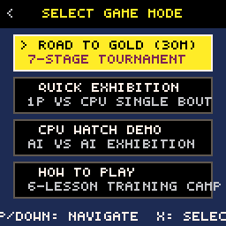
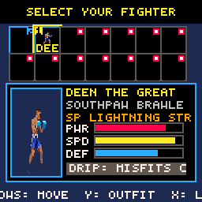
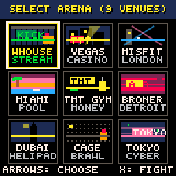
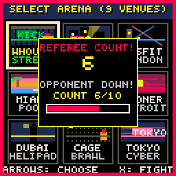
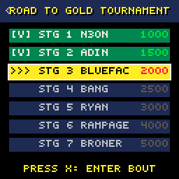
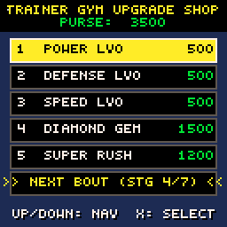
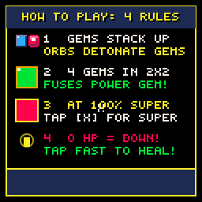
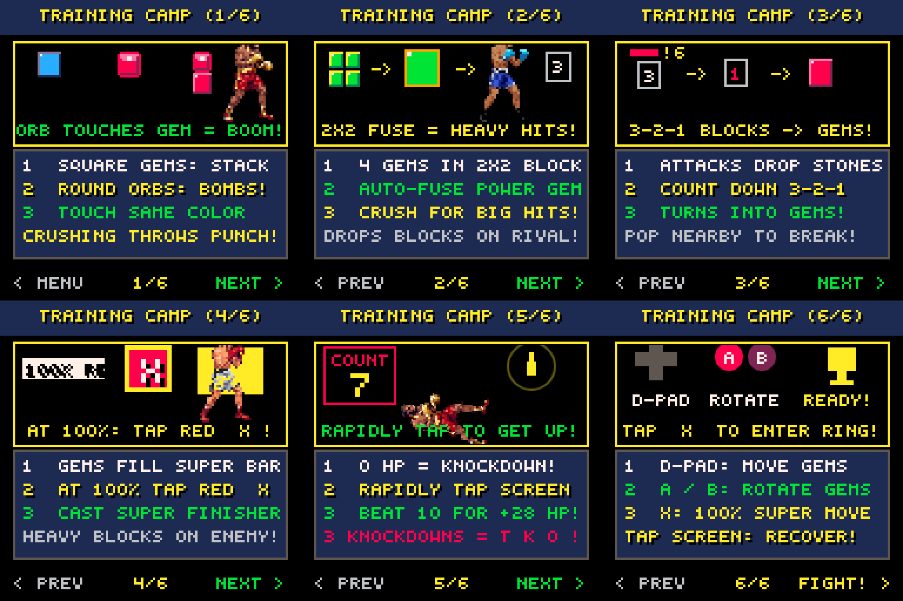

# 🥊 CRASH OUT: RING RUSH — The Ultimate Adrien Broner, Deen The Great & COB (Crash Out Boys) Retro Puzzle Boxing Game

[](https://officebeats.github.io/beats-social-media-boxer-game/)
[](https://raw.githubusercontent.com/officebeats/beats-social-media-boxer-game/main/crash_out.p8)
[](https://officebeats.github.io/beats-social-media-boxer-game/)
[](https://officebeats.github.io/beats-social-media-boxer-game/)
[](https://officebeats.github.io/beats-social-media-boxer-game/)
[](https://officebeats.github.io/beats-social-media-boxer-game/)
[](https://officebeats.github.io/beats-social-media-boxer-game/)

---

## ⚡ Play Live & Download Cartridge

🎮 **[Click Here to Play CRASH OUT: RING RUSH Live in Browser (GitHub Pages)](https://officebeats.github.io/beats-social-media-boxer-game/)**  
*(Optimized for Mobile Touchscreens, iOS/Android, Desktop Browsers, Keyboards & Bluetooth Gamepads)*

📥 **[Download Latest Native PICO-8 Cartridge (`crash_out.p8`)](https://raw.githubusercontent.com/officebeats/beats-social-media-boxer-game/main/crash_out.p8)**  
*(Load natively in PICO-8 using `pico8 -run crash_out.p8` or on Anbernic RG35XX, Miyoo Mini Plus, Steam Deck, and retro handhelds)*

---

## 📖 Overview & Concept

**Crash Out: Ring Rush** is an adrenaline-fueled 8-bit arcade puzzle-fighter engineered for the **PICO-8 Fantasy Console** and modernized with a high-performance **HTML5 Canvas 60 FPS engine**.

The game combines the legendary competitive match-and-crush mechanics of Capcom's *Super Puzzle Fighter II Turbo* with the viral, high-stakes culture of the **Kick warehouse boxing streams**, hosted by 4-division World Champion **Adrien "The Problem" Broner** and influencer boxing world champion **Deen The Great**, alongside the broader **Crash Out Boys (COB)** universe.

Step into the squared circle as your favorite social media boxers, YouTube & Kick streamers, and world-class champions. Clear colored gems, trigger massive combo cascades, execute signature cinematic special punches, survive dramatic 10-count knockdowns, and climb the 7-Stage **Road to Gold** tournament ladder to claim the 50-0 Championship Belt!

```
═══════════════════════════════════════════════════════════════════════════
  🥊 CRASH OUT: RING RUSH — CORE FEATURE MATRIX (v3.8.1)
═══════════════════════════════════════════════════════════════════════════
  ⭐ 14 Playable Fighters     • Adrien Broner, Deen The Great & 12 Viral Guests
  ⭐ 9 Dynamic Arenas         • Kick Warehouse, Vegas Title Bout, Tokyo Dojo, etc.
  ⭐ 4 Distinct Game Modes     • 30-Min Road to Gold, 1P vs CPU, CPU Demo, Training
  ⭐ 6-Lesson Training Camp   • Full interactive visual guide & combat cheat sheet
  ⭐ Grounded Lock Engine     • Anti-spin lock-in physics & instant responsive drops
  ⭐ 10-Count KD Survival     • Button mashing second-wind recovery & 3-KD TKO rule
  ⭐ Super Move Finishers     • 100% meter activation with unique cinematic FX
  ⭐ 12 GBA Console Skins     • Classic Indigo, Glacier, Atomic Purple, Gold, etc.
  ⭐ Universal Controller API • Pocket Taco Bluetooth Gamepad, Keyboard & Touch
═══════════════════════════════════════════════════════════════════════════
```

---

## 📸 In-Game Screenshots & Visual Showcase

Experience authentic retro arcade gameplay with handcrafted 16-color pixel art, 4-frame idle bouncing animations, dynamic venue lighting, and responsive handheld chassis:

### 1. 🏠 Home Title Screen (Exhibition Match)
*Live Kick broadcast banner (`LIVE 148K KICK.COM/BRONER`), retro arcade typography, and animated center-ring exhibition featuring Adrien Broner and Deen The Great in desynchronized idle stances.*

<p align="center">
  
</p>

---

### 2. 🕹️ Game Mode Selection
*Select between the deep 30-minute 7-Stage Road to Gold Tournament Campaign, single Quick Exhibition (1P vs CPU), CPU Watch Demo (AI vs AI), or the 6-Lesson Interactive Training Camp.*

<p align="center">
  
</p>

---

### 3. 🥊 Boxer Selection & Fighter Bio
*Browse 14 celebrity stream fighters with animated 4-frame sprites, stat radar meters (Power, Defense, Speed, Stamina), bio cards, and toggleable Classic vs Alt Viral skins.*

<p align="center">
  
</p>

---

### 4. 🏟️ Stage & Arena Selection
*Battle across 9 dynamic venues with custom crowd density, flashing broadcast lighting, warehouse ring ropes, and arena-specific background atmospheres.*

<p align="center">
  
</p>

---

### 5. ⚡ Live Boxing Match Gameplay
*Real-time puzzle boxing in action: falling colored gem pairs, 2x2 fused giant Power Gems, 3-turn countdown counter blocks, live health bars, Super Meters, and simultaneous sprite punches.*

<p align="center">
  
</p>

---

### 6. ⏱️ Knockdown 10-Count Puzzle Survival
*When a fighter hits 0 HP, the referee initiates a dramatic 10-count! Rapidly mash punch buttons or tap the screen to fill the Stamina meter and score a +28 HP Second Wind before count 10.*

<p align="center">
  
</p>

---

### 7. 🏆 7-Stage Tournament Ladder Bracket
*Climb the Road to Gold tournament bracket, earn purse prize money after every knockout victory, and face the legendary 50-0 Boss Floyd in the Grand Finale!*

<p align="center">
  
</p>

---

### 8. 🏋️ Coach Gym Upgrade Shop
*Visit the Gym between tournament bouts to invest purse cash into permanent RPG stat boosts (Power Punching, Steel Chin Defense, Fast Drop Speed, and Diamond Seeds).*

<p align="center">
  
</p>

---

### 9. 📜 First-Fight Quick Rules Guide
*Session-aware quick overlay appearing before Round 1 to give first-time players an instant 4-rule summary of matching, power gem fusing, super moves, and knockdown recovery.*

<p align="center">
  
</p>

---

## 🥊 The Complete 14-Fighter Roster

Every fighter in **Crash Out: Ring Rush** features custom 48×48 pixel art sprites, authentic 4-frame idle animation cadences, signature punch animations, and bespoke cinematic **Super Moves**:

| # | Fighter | Role & Identity | Signature Punch | Super Finisher (100% Meter) |
|---|---|---|---|---|
| **01** | **Adrien "The Problem" Broner** | Host / 4-Division World Champion | Philly Shell Counter | **ABOUT BILLIONS!** (Shatters all counter blocks into Gold Power Gems, +35 HP, drops 14 blocks) |
| **02** | **Deen The Great** | Host / Influencer Boxing Champion | Lightning Straight | **LIGHTNING STRAIGHT!** (Clears board center columns 2 & 3, drops Red/Blue Crash Orbs, +36 HP, drops 13 blocks) |
| **03** | **Ryan Garcia** | Social Media & Boxing Superstar | Flash Left Hook | **FLASH LEFT HOOK!** (Clears bottom 4 rows with flash hook wave, +38 HP, drops 15 blocks) |
| **04** | **N3on** | Kick Streamer / Crash Out King | Crashout Spam | **CRASH OUT SPAM!** (Detonates 8 random crash orbs with rapid-fire garbage, +28 HP, drops 16 blocks) |
| **05** | **Ray J** | Tech Entrepreneur & Stream Icon | Glasses Flash | **CRASH OUT SPAM!** (Spawns a massive Rainbow Diamond on board, +30 HP, drops 12 blocks) |
| **06** | **Blueface** | Rap Superstar & Exhibition Boxer | Famous Hook | **FAMOUS HOOK!** (Smashes outer columns 0 & 5 with wall slam, +35 HP, drops 14 blocks) |
| **07** | **Chrisean Rock** | Viral Star & Tough Fighter | Baddie Overhand | **BADDIE OVERHAND!** (Clears top 4 rows with wild right hook, +32 HP, drops 14 blocks) |
| **08** | **Rampage Jackson** | MMA Legend & Warehouse Enforcer | Rampage Slam | **RAMPAGE SLAM!** (Ground-pound shockwave shatters bottom 2 rows, +34 HP, drops 13 blocks) |
| **09** | **Adin Ross** | Kick Stream Host / Warehouse Boss | Stream Raid Nuke | **STREAM RAID NUKE!** (Chat bomb explodes opponent's bottom 2 rows, +28 HP, drops 12 blocks) |
| **10** | **Charleston White** | Viral Stream Guest & Agitator | Pepper Spray Rant | **PEPPER SPRAY RANT!** (Blinds opponent's bottom row with stone blocks, +30 HP, drops 14 blocks) |
| **11** | **Coach Bang** | Veteran Warehouse Head Trainer | Bang Body Combo | **BANG BODY COMBO!** (4-hit rapid body combination clearing 3 rows, +36 HP, drops 14 blocks) |
| **12** | **Antonio Brown (AB)** | NFL Superstar & Stream Guest | CT KO Touchdown | **CT KO TOUCHDOWN!** (Football spike converting all Blue gems to Gold, +33 HP, drops 15 blocks) |
| **13** | **Fousey** | G7 Stream Pioneer | G7 Crash Out | **G7 CRASH OUT!** (G7 rage shockwave infecting top rows with stone blocks, +38 HP, drops 16 blocks) |
| **14** | **Sneako** | Creative Stream Commentator | Red Pill Counter | **RED PILL COUNTER!** (Matrix bullet-time counter weave: absorbs pending garbage & heals +20 HP, drops 14 blocks) |

---

## 🏟️ 9 Dynamic Arenas

Fight in authentic environments with distinct color palettes, dithered crowd animations, and atmospheric backdrops:

1. **Kick Stream Warehouse**: The iconic underground stream venue with yellow hazard ropes, production lights, and chaotic livestream chat energy.
2. **Underground Street Fight**: Raw asphalt battleground with chain-link fences, graffiti, and gritty nighttime street crowds.
3. **Vegas Title Bout**: Glamorous neon-lit arena with golden championship ropes and VIP celebrity crowds.
4. **Miami Rooftop Gym**: Golden hour sunset skyline with palm trees and ocean breeze aesthetic.
5. **Tokyo Underground Dojo**: Atmospheric cyberpunk alley arena with glowing paper lanterns and retro neon signage.
6. **London O2 Arena**: Grand international championship stage with high-intensity floodlights.
7. **Brooklyn Fight Club**: Raw industrial brick warehouse with exposed pipes and localized fight fans.
8. **Riyadh Mega Stadium**: Luxurious gold-and-purple super-stadium venue for mega-fight spectacles.
9. **Gym Training Dojo**: Wooden floor sparring gym with punching bags and speedbag stations.

---

## 🎮 Game Modes

### 1. 🏆 Road to Gold Campaign (30-Minute Tournament)
- **7-Stage Progression**: Fight through an escalating ladder of contenders leading up to the 50-0 Grand Champion Boss fight!
- **Purse Earnings**: Earn purse money for every knockout victory, plus sweep bonuses and remaining HP multipliers.
- **Gym Upgrade Shop**: Spend your winnings on Power, Defense, Drop Speed, and Diamond Seeds.
- **Post-Fight Press Conferences**: Experience animated post-bout interviews and Punch-Out style ranking ladder climbs.
- **State Persistence**: Automatic `localStorage` campaign saving allows you to pause and resume anytime.

### 2. ⚡ Quick Exhibition (1P vs CPU)
- Jump directly into a single-round or best-of-3 exhibition match.
- Choose any unlocked fighter from the 14-boxer roster.
- Select from all 9 dynamic arenas.

### 3. 🤖 CPU Watch Demo (AI vs AI)
- Relax and watch automated AI vs AI exhibition matches.
- High-level heuristic AI algorithms demonstrate advanced 2x2 gem fusion and combo cascade strategies.

### 4. 📚 6-Lesson Training Camp & Visual Guide
- **Lesson 1**: Match & Crush (Stack 2 identical colors with a Crash Orb to pop).
- **Lesson 2**: Power Gems (Fuse 2×2, 2×3, or 3×3 square blocks into giant fused gems).
- **Lesson 3**: Counter Blocks (Manage incoming garbage stones with 3-turn countdown timers).
- **Lesson 4**: 100% Super Move Finishers (Execute cinematic character-specific Super Punches).
- **Lesson 5**: Knockdown 10-Count Survival (Rapid button-mashing recovery mechanics).
- **Lesson 6**: Complete Controls & Combat Cheat Sheet.

<p align="center">
  
</p>

---

## 🕹️ Controls & Hardware Compatibility

**Crash Out: Ring Rush** supports every modern input method seamlessly:

### ⌨️ Desktop Keyboard Controls
| Action | Primary Key | Alternative Key |
|---|---|---|
| **Move Gem Left / Right** | `←` / `→` | `A` / `D` |
| **Soft Drop** | `↓` | `S` |
| **Hard Drop (Instant Lock)** | `↑` | `W` / `Space` |
| **Rotate Counter-Clockwise** | `Z` | `K` |
| **Rotate Clockwise / Confirm** | `X` | `J` / `Enter` |
| **Trigger 100% Super Move** | `X` (at 100%) | `C` / `V` |
| **Switch Fighter Outfit** | `Y` | `C` |
| **View Fighter Bio** | `B` | `V` |
| **Pause / Menu** | `Enter` | `Escape` |

### 📱 Mobile Touch Controls
- **On-Screen GBA D-Pad**: Tap or slide left/right/down to maneuver falling gems.
- **Action Buttons (`A` / `B`)**: Large responsive tactile buttons with subtle haptic vibration feedback.
- **Direct Canvas Tap**: Tap directly on the game screen to dismiss overlays, advance dialogues, or trigger quick recovery.

### 🎮 Pocket Taco & Bluetooth Gamepads
- Plug in any standard Bluetooth, Xbox, PlayStation, or **Pocket Taco** controller.
- Automatic gamepad detection with instant button mapping.

---

## ⚙️ Technical Architecture & PICO-8 Specs

- **Fantasy Console**: PICO-8 (8,192 Lua Tokens, 32 KB compressed cartridge footprint).
- **Native Resolution**: 128 × 128 Pixels (scaled to crisp 256×256 2x high-DPI on HTML5 canvas).
- **Palette**: PICO-8 16-Color Palette (Hex-accurate shading).
- **Frame Rate**: Locked 60 FPS update loop (`_update60()`).
- **Audio Engine**: 4-channel retro chiptune synthesizer with authentic 808 sub-bass kicks, referee counts, and punch sound effects.
- **Zero External Dependencies**: Pure native JavaScript and HTML5 Canvas with no heavy frameworks.

---

## 🛠️ Local Development & Build Instructions

### Run Locally in Browser
```bash
# 1. Clone the repository
git clone https://github.com/officebeats/beats-social-media-boxer-game.git
cd beats-social-media-boxer-game

# 2. Start a lightweight local HTTP server
python -m http.server 8000
# or with Node.js:
npx serve .

# 3. Open in browser
open http://localhost:8000/index.html
```

### Build & Validate PICO-8 Cartridge
```bash
# Generate and validate crash_out.p8
python build_cartridge.py
```

---

## 🔍 SEO & Search Keywords

*Find this game online by searching:*  
**Adrien Broner Game**, **Deen The Great Boxing Game**, **COB Game**, **Crash Out Boys Game**, **Crash Out Ring Rush**, **Kick Boxing Stream Game**, **Influencer Boxing Game**, **Super Puzzle Fighter Boxing**, **PICO-8 Boxing Game**, **Retro Arcade Boxing**, **Adrien Broner vs Deen The Great**, **Ryan Garcia Boxing Game**, **N3on Boxing Game**, **Adin Ross Boxing Game**, **Blueface Boxing Game**, **Chrisean Rock Boxing Game**, **Rampage Jackson Boxing Game**, **Floyd Mayweather 50-0 Boss Fight**, **8-Bit Retro Boxing**.

---

## 📜 License & Credits

- **Game Design & Development**: © 2026 Office Beats Studios
- **Inspiration**: Capcom's *Super Puzzle Fighter II Turbo*, Nintendo's *Punch-Out!!*, and the Kick stream boxing culture.
- **Distribution**: Open-source web edition hosted on GitHub Pages.
